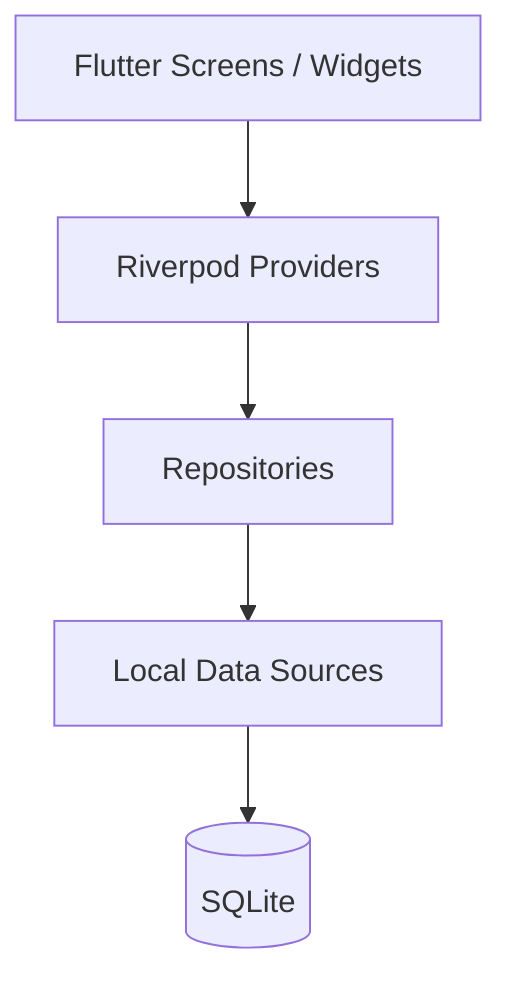

# Arquitetura

```mermaid
flowchart TD
    UI[Flutter Screens / Widgets]
    STATE[Riverpod Providers]
    REPO[Repositories]
    DS[Local Data Sources]
    DB[(SQLite)]
    UI --> STATE --> REPO --> DS --> DB
```

A UI não executa SQL diretamente. Os repositórios isolam persistência e facilitam testes.
