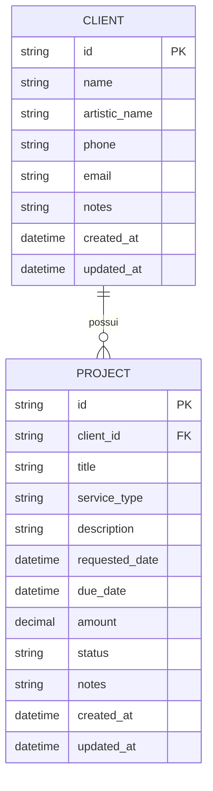

# Modelagem de dados

```mermaid
erDiagram
    CLIENT ||--o{ PROJECT : possui
    CLIENT { string id PK string name string artistic_name string phone string email string notes datetime created_at datetime updated_at }
    PROJECT { string id PK string client_id FK string title string service_type string description datetime requested_date datetime due_date decimal amount string status string notes datetime created_at datetime updated_at }
```

Um cliente pode possuir vários projetos. Cada projeto pertence a um cliente.
