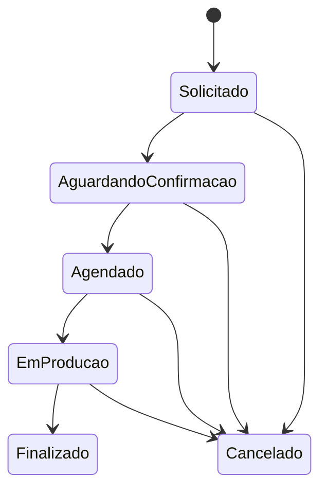

# Status

O diagrama descreve o fluxo sugerido para a demonstração do MVP. O aplicativo
permite selecionar qualquer status ao criar, editar ou atualizar um projeto;
portanto, ele não aplica estas setas como regras de bloqueio. Uma futura regra
de transição exige decisão explícita de produto e testes de exceções, como
cancelamento e reabertura.

